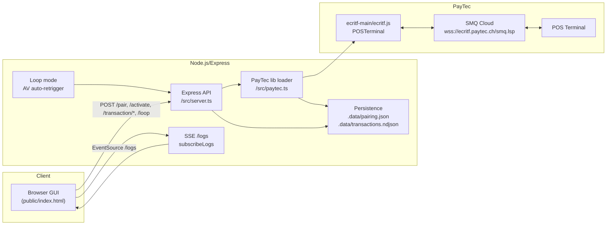

# eftkey

Minimal Node.js + TypeScript app to pair with a PayTec POS terminal via the cloud, send pairing codes, run basic transactions, and view logs in a simple GUI.

## Quick start

1) Install dependencies

```bash
npm install
```

2) Start the app

```bash
npm run dev
```

3) Open the GUI

- Browser: http://localhost:3000

4) Pairing

- Enter the pairing code shown on the terminal (e.g., 6017087) and submit.
- Check logs for: `[eftkey] pairing succeeded`.
- Pairing info is persisted to `.data/pairing.json` and loaded on startup.

5) Healthcheck

```bash
curl http://localhost:3000/healthz
```

## GUI features

- Pairing form: send code to `/pair`.
- Status card: current pairing info, terminal status.
- Actions:
  - Terminal aktivieren → `/activate`
  - ACCOUNT_VERIFICATION → `/transaction/account-verification`
  - PURCHASE → `/transaction/purchase` (enter amount in minor units, e.g., 1575 = CHF 15.75)
- Loop mode: auto-repeat ACCOUNT_VERIFICATION after a successful receipt/approval with a configurable delay.
- Live logs: streamed via Server-Sent Events from `/logs`.
- Results log: transaction outcomes are persisted to `.data/transactions.ndjson` (NDJSON).

## API endpoints

- `GET /healthz` → `{ ok: true }`
- `GET /pairing` → current pairing JSON or `null`
- `POST /pair` → `{ code: string }` pairs using `trm.pair(code, 'eftkey POS')`
- `POST /activate` → triggers terminal activation
- `POST /transaction/account-verification` → starts ACCOUNT_VERIFICATION
- `POST /transaction/purchase` → `{ AmtAuth: number, TrxCurrC?: number, RecOrderRef?: object }`
- `GET /logs` → Server-Sent Events (see GUI)
- `GET /loop` → `{ enabled, delayMs }`
- `POST /loop` → `{ enabled?: boolean, delayMs?: number }`

## Result logging (persisted)

- File: `.data/transactions.ndjson`
- One JSON object per line with fields:
  - `ts`: ISO timestamp
  - `type`: `transactionApproved | transactionDeclined | transactionAborted | transactionTimedOut | transactionConfirmationSucceeded | transactionConfirmationFailed`
  - `status`: last known `TrmStatus`
  - `payload`: full PayTec event payload (includes amounts, AID, IIN, refs if provided)

## Configuration

- `PORT` (default: `3000`)
- `DATA_DIR` (default: `.data`) directory for persisted pairing info

## Scripts

- `npm run dev` → start in watch mode with ts-node + nodemon
- `npm run build` → compile TypeScript to `dist/`
- `npm start` → run compiled app from `dist/`

## Notes

- The app uses the local PayTec library found in `ecritf-main/ecritf.js`.
- Cloud transport endpoint is managed internally by the PayTec library (`wss://ecritf.paytec.ch/smq.lsp`).
- Pairing and transaction logs are visible both in the terminal output and in the GUI log panel.
- Pairing endpoint includes a safe retry that recreates the terminal on SMQ/TID errors.

## Architecture diagram



## Git usage

Initialize and push to your repository:

```bash
git init
git add .
git commit -m "feat: initial eftkey MVP with pairing, GUI, and loop mode"
git branch -M main
git remote add origin <YOUR_GIT_REMOTE_URL>
git push -u origin main
```

Use feature branches for changes:

```bash
git checkout -b feat/transaction-endpoints
# ...changes...
git commit -m "feat: add purchase endpoint"
git push -u origin feat/transaction-endpoints
```

See `TECHNICAL.md` for a deeper technical overview.
