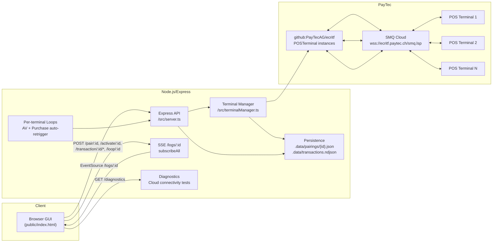
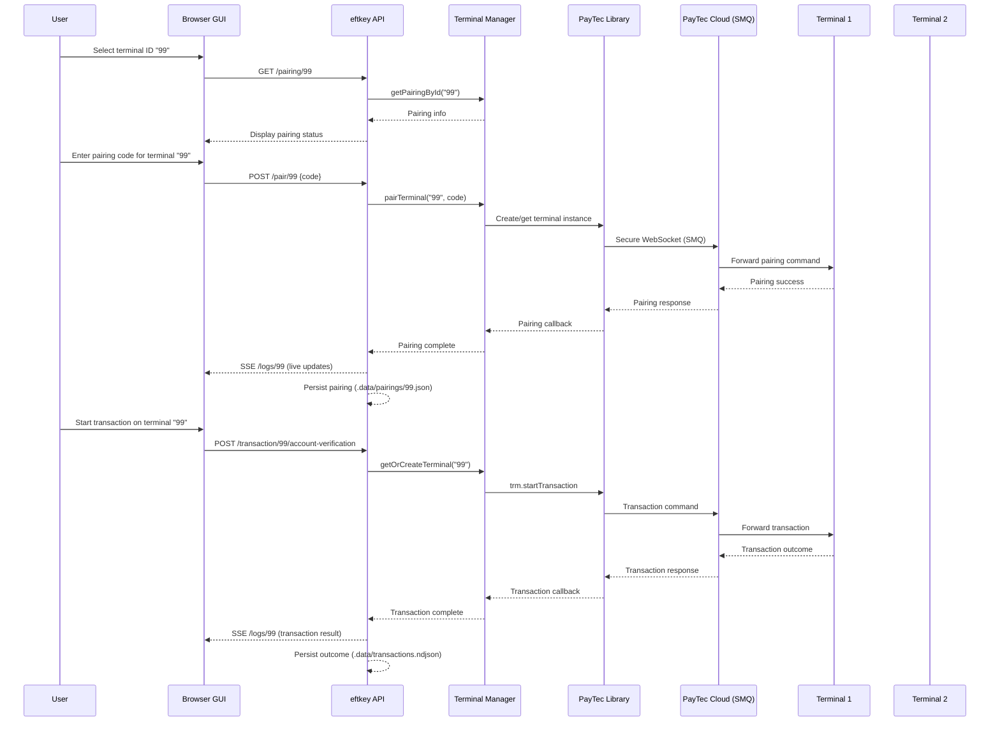

# eftkey

Multi-terminal Node.js + TypeScript app to pair with PayTec POS terminals via the cloud, send pairing codes, run transactions, and manage multiple terminals with individual loop configurations.

Uses the official PayTec ECR interface: [PayTecAG/ecritf](https://github.com/PayTecAG/ecritf).

## Quick start

1) Install dependencies

```bash
npm install
```

2) Start the app

```bash
npm run dev
```

3) Open the GUI

- Browser: http://localhost:3000

4) Multi-terminal setup

- **Terminal-ID wählen**: Enter a terminal ID (e.g., `default`, `99`, `1`) and click "Laden"
- **Pairing**: Enter the pairing code shown on the terminal (e.g., 6017087) and submit
- **Automatic loading**: Pairing info is persisted to `.data/pairings/{terminalId}.json` and loaded on startup
- **Multiple terminals**: Each terminal ID has its own pairing, loop settings, and transaction history

5) Healthcheck

```bash
curl http://localhost:3000/healthz
```

## GUI features

- **Terminal selection**: Choose terminal ID and load its configuration
- **Pairing form**: Send pairing code to specific terminal
- **Status card**: Current pairing info, terminal status, connection diagnostics
- **Actions** (per terminal):
  - Terminal aktivieren → `/activate/:id`
  - ACCOUNT_VERIFICATION → `/transaction/:id/account-verification`
  - PURCHASE → `/transaction/:id/purchase` (enter amount in minor units, e.g., 1575 = CHF 15.75)
- **Loop modes** (per terminal):
  - ACCOUNT_VERIFICATION loop: auto-repeat after successful receipt/approval/decline/abort/timeout
  - PURCHASE loop: configure amount/currency/delay for automatic PURCHASE retriggering
- **Live logs**: Streamed via Server-Sent Events from `/logs/:id` (filtered by terminal)
- **Connection diagnostics**: Test cloud connectivity and terminal readiness
- **Results log**: Transaction outcomes persisted to `.data/transactions.ndjson` with terminal ID

## API endpoints

### Core endpoints
- `GET /healthz` → `{ ok: true }`
- `GET /terminals` → `{ ids: string[] }` - list all known terminal IDs

### Terminal-specific endpoints (replace `:id` with terminal ID)
- `GET /pairing/:id` → pairing JSON for specific terminal
- `POST /pair/:id` → `{ code: string }` pair specific terminal
- `POST /activate/:id` → activate specific terminal
- `POST /transaction/:id/account-verification` → start ACCOUNT_VERIFICATION
- `POST /transaction/:id/purchase` → `{ AmtAuth: number, TrxCurrC?: number, RecOrderRef?: object }`
- `GET /logs/:id` → Server-Sent Events for specific terminal

### Loop configuration (per terminal)
- `GET /loop/:id` → `{ enabled: boolean, delayMs: number }` - ACCOUNT_VERIFICATION loop
- `POST /loop/:id` → `{ enabled?: boolean, delayMs?: number }` - configure ACCOUNT_VERIFICATION loop
- `GET /loop/:id/purchase` → `{ enabled: boolean, amount: number, currency: number, delayMs: number }` - PURCHASE loop
- `POST /loop/:id/purchase` → `{ enabled?: boolean, amount?: number, currency?: number, delayMs?: number }` - configure PURCHASE loop

### Diagnostics
- `GET /diagnostics` → `{ ok: boolean, serverTime: string, uptimeSec: number, cloud: object }` - global connectivity test
- `GET /diagnostics/terminal/:id` → `{ ok: boolean, id: string, paired: boolean, status: number, ready: boolean }` - terminal-specific status

## Result logging (persisted)

- File: `.data/transactions.ndjson`
- One JSON object per line with fields:
  - `ts`: ISO timestamp
  - `terminalId`: terminal ID that generated the event
  - `type`: `transactionApproved | transactionDeclined | transactionAborted | transactionTimedOut | transactionConfirmationSucceeded | transactionConfirmationFailed`
  - `status`: last known `TrmStatus` for the terminal
  - `payload`: full PayTec event payload (includes amounts, AID, IIN, refs if provided)

## Data persistence

- **Pairing data**: `.data/pairings/{terminalId}.json` - one file per terminal ID
- **Transaction outcomes**: `.data/transactions.ndjson` - all outcomes with terminal ID
- **Terminal state**: In-memory per-terminal loop configurations and status tracking

## Deployment & Configuration

- Dev:

```bash
npm run dev
```

- Build & start:

```bash
npm run build
npm start
```

Environment variables:
- `PORT` (default: `3000`)
- `DATA_DIR` (default: `.data`) directory for persisted pairing and logs

## Scripts

- `npm run dev` → start in watch mode with ts-node + nodemon
- `npm run build` → compile TypeScript to `dist/`
- `npm start` → run compiled app from `dist/`

## Notes

- Uses the official PayTec library from GitHub: `github:PayTecAG/ecritf`
- Cloud transport endpoint is managed internally by the PayTec library (`wss://ecritf.paytec.ch/smq.lsp`)
- Each terminal ID maintains its own pairing channel and connection state
- Pairing and transaction logs are visible both in the terminal output and in the GUI log panel
- Loop modes automatically retrigger transactions after completion (approved/declined/aborted/timeout)
- Connection diagnostics help troubleshoot cloud connectivity issues
- All endpoints are now ID-based for multi-terminal support

## Architecture diagram



## Communication flow (multi-terminal view)



## Git usage

Initialize and push to your repository:

```bash
git init
git add .
git commit -m "feat: multi-terminal eftkey with pairing, GUI, loops, and diagnostics"
git branch -M main
git remote add origin <YOUR_GIT_REMOTE_URL>
git push -u origin main
```

Use feature branches for changes:

```bash
git checkout -b feat/transaction-endpoints
# ...changes...
git commit -m "feat: add purchase endpoint"
git push -u origin feat/transaction-endpoints
```

See `TECHNICAL.md` for a deeper technical overview.
